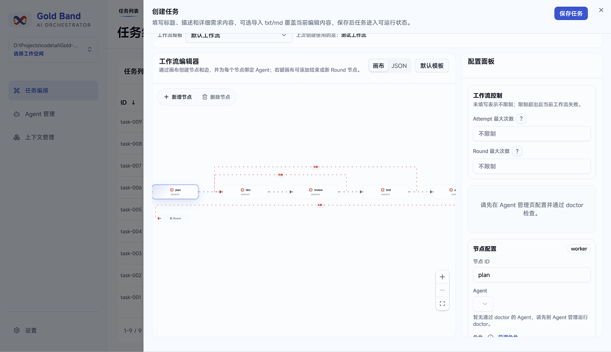
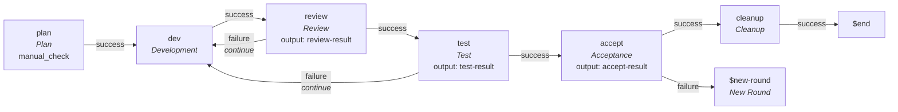
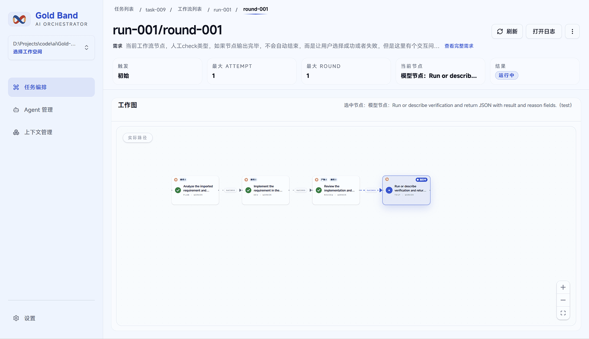
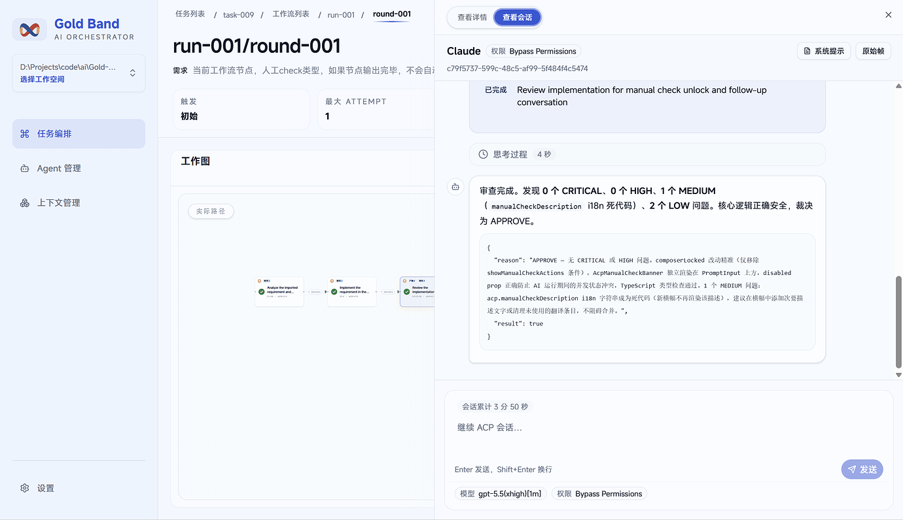
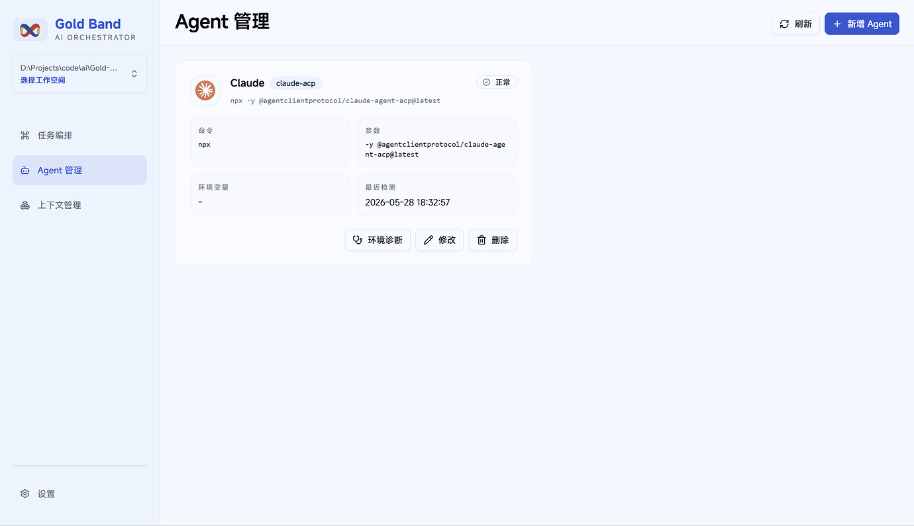
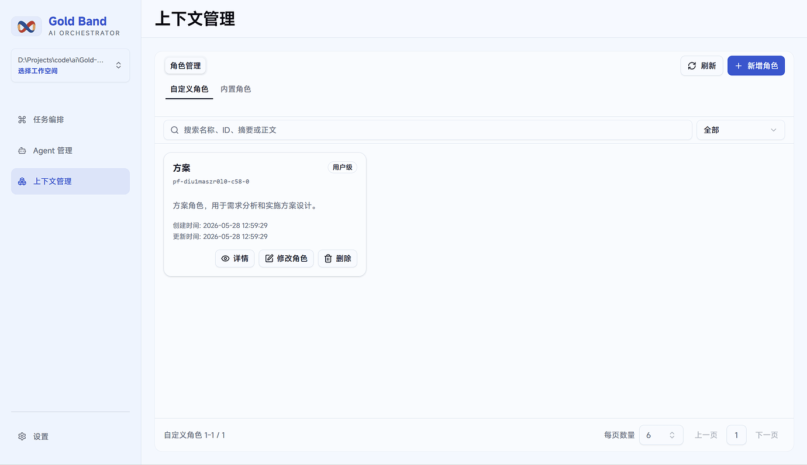

<div align="center">


# Gold Band

> Local · Workflow-Driven · AI Agent Orchestration
>
> Making long-running AI Coding tasks more controllable, observable, and reliable

[](https://github.com/diodeme/Gold-Band/stargazers)
[](LICENSE)
[](#)
[](https://github.com/diodeme/Gold-Band/releases)

[Download](https://github.com/diodeme/Gold-Band/releases)

[中文](README.md)

</div>

---

Gold Band is currently in **Developer Preview**.

The project is inspired by the idea of the "gold band" from *Journey to the West*: AI Agents are powerful and creative, but in complex engineering tasks they also need boundaries, orchestration, verification, and context management. Gold Band aims to provide that engineering layer so Agents can work more steadily across long-running tasks.

In simpler terms, Gold Band can be understood as a **local Agent workflow version of Dify**, but focused on developer workflows, local execution, Agent orchestration, and AI Coding reliability.

## Status

Gold Band is still at an early stage.

The current MVP can already run through the core workflow, but product experience, edge cases, stability, and engineering details are still being actively improved. APIs, UX, workflow behavior, and internal implementation may change before a stable release.

At this stage, feedback from early users is especially valuable. Issues related to the core workflow will be prioritized first.

## Tech Stack

- Rust
- React
- Tauri 2
- Agent Client Protocol / ACP

## Why Gold Band

During AI Coding practice, I repeatedly ran into several problems:

1. **Long-running tasks are hard to orchestrate reliably.**
   Even with strategies such as subagents or agent teams, the main orchestrator can still make routing mistakes when the task becomes too long. Sometimes it may even skip orchestration and directly start doing the work itself.

2. **Agent self-verification is not always trustworthy.**
   In loop-based workflows, the same Agent may act as both player and judge. Without cross-validation, a `completed` result does not always mean the output is actually reliable.

3. **Context and capability loading are fragmented.**
   Skills, constitutions, MCP tools, rules, and other context sources are often managed differently across Agents. Maintaining and migrating these configurations can become painful over time.

4. **Agent platform limitations can block workflow design.**
   For example, Claude Code subagents previously could not inherit the skill list from the main session and had to rely on the main Agent to pass information or predefine capabilities. This issue has been fixed in newer versions, but it was one of the triggers that made me want to build an external orchestration and context-management layer.

Gold Band is built around the belief that good AI applications should use engineering methods to reduce instability while preserving the creative power of AI.

## Core Ideas

Gold Band focuses on four core capabilities:

- **Workflow orchestration**: define how Agents move through planning, development, review, testing, acceptance, and cleanup.
- **Context management**: manage roles and, in the future, skills, rules, MCP, and other reusable context assets.
- **Cross-validation**: separate development, review, testing, and acceptance so results can be checked by different nodes.
- **Observability**: inspect Agent sessions, system prompts, raw ACP frames, artifacts, attachments, rounds, and attempts.

## Features

### Workflow Orchestration

Users can assign a workflow when creating a task. Workflows can be created visually on the canvas or reused from existing templates. Gold Band also ships with a built-in workflow.



#### Concepts

**Node**

A node represents one Agent execution. Users can configure Agents in Agent Management. In theory, any ACP-compatible Agent can be started, but because different Agents vary in ACP support quality, Gold Band only adds Agents to the recommended list after testing. At the current stage, **Claude Code** has been verified.

**Role**

Each node can have a role. The role is appended to the system prompt. If an ACP Agent does not support appending system prompts, Gold Band currently appends it to the user prompt instead. Roles can be managed in Context Management. Built-in roles are provided, and users can save modified versions as custom roles.

**Permission Mode**

Permission modes are obtained during the ACP handshake. Users can select the supported permission mode in node settings.

**Result Evaluation**

Result evaluation determines the branch direction after a node finishes.

Gold Band currently supports two approaches:

1. **Manual check**: the user manually marks a node as success or failure. This is suitable for plan-review or other human-audited stages.
2. **AI output validation**: the Agent is asked to output a structured DSL, and Gold Band evaluates the result using an expression.

Example:

```json
{
  "reason": "String",
  "result": "boolean"
}
```

```js
$.result == true
```

**Edge**

Edges define how nodes are connected. Users can edit the target node and session mode:

- `new`: start a new session
- `continue`: continue in the previous session

### Built-in Workflow

Gold Band currently includes the following default workflow:



Important behavior:

- If review or testing fails, the workflow loops back to the development node using `continue` mode.
- The acceptance node verifies whether the requirement has truly been completed.
- If acceptance fails, Gold Band generates a report and starts a new round.
- After acceptance, the cleanup node organizes process artifacts and persists them to the project directory.
- Users are not required to use the built-in workflow and can create their own preferred workflows.

### Task Execution

Users can start a new run from a task directory. A single requirement can be executed multiple times. After a run starts, users can inspect the execution details of each round.



#### Concepts

**Attempt**

A loop between two nodes counts as one attempt. For example, `test -> failure -> dev` is one attempt. Workflows can limit the maximum number of attempts per node pair at runtime.

**Round**

A node can specify an ending state that starts a new round. A new round restarts the workflow from the beginning, and Gold Band informs the Agent of the current round and the artifact directory from the previous round. Workflows can limit the maximum number of rounds at runtime.

**Artifact Directory**

Process artifacts are stored under:

```txt
~/.gold-band/projects/<project-path>
```

Example:

```txt
# artifacts
~/.gold-band/projects/D--Projects-code-ai-Gold-Band/tasks/task-001/runs/run-001/rounds/round-001/nodes/dev/attempt-001/artifacts

# attachments
~/.gold-band/projects/D--Projects-code-ai-Gold-Band/tasks/task-001/runs/run-001/rounds/round-001/nodes/dev/attempt-001/attachments
```

**Artifact**

For nodes with explicit output requirements, Gold Band automatically places the node output under `artifacts`. This is related to AI output validation.

**Attachments**

Agents can freely output files and reports under `attachments`, such as test reports or intermediate notes.

### Session Observation

During node execution, users can observe the real-time session state. After the session ends, users can also open the corresponding CLI session. When a node finishes, users can continue chatting in the same window using `continue` mode.



Supported observations include:

- **System prompt**: the system prompt appended by Gold Band at runtime.
- **Raw frames**: raw ACP session frames for debugging and troubleshooting.

### Agent Management

Gold Band starts Agents through ACP and provides configuration and environment diagnostics in Agent Management.

Although Gold Band theoretically supports all ACP-compatible Agents, the current recommendation is to start with **Claude Code**, because it has been verified in the current implementation.



### Context Management

Gold Band currently supports role management. Built-in roles cannot be directly modified or deleted, but they can be copied and saved as custom roles.

Future versions may expand this area to support skills, rules, MCP, and other reusable context assets.



### Settings

Current settings include:

- Chinese / English language switching
- Theme switching
- Font switching
- Update mechanism
- Local Claude Code switch

The local Claude switch is temporary and may be optimized later. When enabled, Gold Band uses the local Claude Code executable. When disabled, the Claude Code ACP component pulls the `claude.exe` bundled in the Claude Code SDK.

## Trade-offs

The built-in workflow is more suitable for large, complex, long-running development tasks.

By splitting work into plan, development, review, testing, acceptance, and cleanup stages, Gold Band can provide stronger constraints and cross-validation. The trade-off is that execution time and token consumption may increase. This is a common trade-off for workflow-based Agent systems.

For small daily tasks, users can define a lighter workflow, such as:

- `plan -> dev`
- `dev -> review`

In the future, Gold Band will explore AI dynamic routing so the system can choose a suitable execution path based on task complexity: simple tasks can pass quickly, while complex tasks can be decomposed, validated, and looped automatically.

## Roadmap

### High Priority

1. **Multi-Agent support**

   Test and integrate Codex, Cursor, Gemini CLI, OpenCode, and potentially more Agents depending on compatibility and stability.

2. **System notifications**

   Notify the user when an Agent requests permission or when a workflow error occurs. This will be configurable in settings.

3. **Adaptive workflow orchestration and concurrent execution**

   Support more flexible execution strategies so Gold Band is not limited to fixed workflow paths.

   - **Node-level concurrency**: one node can dispatch work to multiple downstream nodes and process subtasks in parallel. The maximum concurrency can be configured as an experimental feature.
   - **Requirement-level concurrency**: multiple requirements can be imported at once and executed through the same workflow in parallel. The requirement concurrency limit can be configured as an experimental feature.
   - **AI dynamic routing**: during workflow execution, AI can decide which nodes to enter next, what subtasks to split, and whether parallel execution is needed based on the current goal, context, intermediate artifacts, and execution results.

### Medium Priority

1. Add support and management for skills.
2. Add support and management for MCP.
3. Improve ACP session observation performance, UI, usability, and known issues.
4. Add metrics and dashboards, including session duration and token consumption. Improve accuracy of current session timing.

## Community

This project actively participates in and supports the [linux.do community](https://linux.do).

## Contributing

Gold Band is in Developer Preview, and feedback from real usage is very welcome.

Useful feedback includes:

- Where the core workflow fails or becomes confusing.
- Whether the orchestration model is useful in real AI Coding scenarios.
- Which Agent integrations are most important.
- Which missing capabilities block practical usage.
- Any bugs, rough edges, or unreasonable design choices.

Issues and pull requests are welcome.

## License

AGPL-3.0-only — see [LICENSE](LICENSE).
