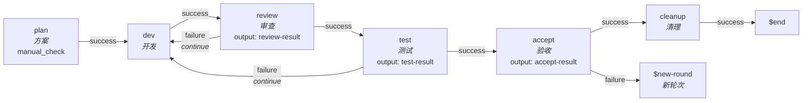

<div align="center">


# Gold Band

> Local-first desktop workflow client for AI Coding
>
> Orchestrate, observe, verify, and recover long-running Agent tasks

[](https://github.com/diodeme/Gold-Band/stargazers)
[](LICENSE)
[](#)
[](https://github.com/diodeme/Gold-Band/releases)

[Download](https://github.com/diodeme/Gold-Band/releases)

<!-- README-I18N:START -->

[中文](./README.md) | **English**

<!-- README-I18N:END -->

</div>

---

Gold Band is a desktop AI Agent workflow client for local projects. It starts local Agents through Agent Client Protocol / ACP and turns long-running AI Coding work into an orchestrated, observable, verifiable, and recoverable runtime process.

Gold Band does not try to replace Claude Code, Codex, Cursor, Gemini, or OpenCode. It is a local runtime and desktop shell above those Agents: it owns workflow control, context injection, artifact archival, state convergence, failure recovery, and runtime observability.

> [!NOTE]
> Gold Band is still in **Developer Preview**. The core path is usable, but AUTO / AI-DYNAMIC, multi-Agent compatibility, complex-task stability, and product experience are still moving quickly. Claude Code and Codex are currently the recommended starting points.

## Why Gold Band

The hard part of AI Coding is often not asking an Agent to write code once. The hard part is keeping it reliable in longer and more complex tasks:

- **Control flow drifts**: in long-running tasks, the main session may forget the original orchestration plan or declare completion before validation.
- **Self-verification is weak**: when the same Agent acts as both worker and judge, `completed` does not always mean the requirement is actually satisfied.
- **Context management is fragmented**: profiles, rules, skills, MCP tools, runtime constraints, and repair instructions are scattered across tools and become hard to maintain.
- **The process is hard to replay**: without unified runs, rounds, nodes, attempts, artifacts, and raw events, failures are difficult to diagnose and resume.

Gold Band's core idea is: **make the control plane deterministic, let Agents handle the execution plane, and decide completion from state, artifacts, and validation instead of Agent self-reporting alone.**

## Core Capabilities

- **Conversation mode**: start tasks like an Agent IDE, inspect streaming sessions, switch sessions, continue conversations, and view input attachments and runtime outputs.
- **Workflow mode**: visually orchestrate nodes such as plan, dev, review, test, accept, and cleanup, with failure loops and new rounds.
- **AUTO / AI-DYNAMIC**: let the runtime dynamically split work, create internal nodes, fan out in parallel, merge, accept, and return to the outer workflow under strict constraints.
- **Multi-Agent management**: configure and diagnose ACP providers such as Claude Code, Codex, Cursor, Gemini, and OpenCode.
- **Runtime observability**: inspect canonical state, ACP session events, raw frames, system prompts, node status, token / duration metrics, artifacts, and attachments.
- **Attachments and artifacts**: support file picking, drag-and-drop, pasted images, input reuse, image preview, node artifacts, and free-form attachments.
- **Context management**: manage user-level and project-level profiles, MCP, and SKILL assets, then reuse them in workflows and dynamic nodes.

## Quick Start

1. Download a desktop package from [Releases](https://github.com/diodeme/Gold-Band/releases), or build from source.
2. Open Gold Band and add a local workspace.
3. Configure an available Agent in Agent Management. Claude Code and Codex are currently recommended first.
4. Return to the conversation home and enter a requirement.
5. Choose a run mode:
   - `WORKFLOW`: use a fixed workflow template for tasks with clear stages and stronger validation.
   - `AUTO`: let AI-DYNAMIC dynamically split and schedule work within runtime constraints.
6. Start the run, then inspect Agent output, node transitions, artifacts, attachments, and runtime state in the conversation detail view.

### Local Development

```bash
npm install
npm run dev
```

Common verification commands:

```bash
cargo check
npm run web:test
npm run web:build
```

## Run Modes

### WORKFLOW

WORKFLOW mode uses an explicit workflow. Each node represents one Agent execution, and edges define how the run moves after success, failure, or manual confirmation.

Typical default workflow:


```mermaid
flowchart LR
      PLAN["plan<br/><i>方案</i><br/>manual_check"] -->|success| DEV["dev<br/><i>开发</i>"]
      DEV -->|success| REVIEW["review<br/><i>审查</i><br/>output: review-result"]
      REVIEW -->|success| TEST["test<br/><i>测试</i><br/>output: test-result"]
      REVIEW -->|"failure<br/><i>continue</i>"| DEV
      TEST -->|success| ACCEPT["accept<br/><i>验收</i><br/>output: accept-result"]
      TEST -->|"failure<br/><i>continue</i>"| DEV
      ACCEPT -->|success| CLEANUP["cleanup<br/><i>清理</i>"]
      ACCEPT -->|failure| NEW_ROUND["$new-round<br/><i>新轮次</i>"]
      CLEANUP -->|success| END["$end"]
```

This mode is useful when:

- The requirement has clear development, review, testing, and acceptance stages.
- Failures should loop back to a specific node for repair.
- Acceptance criteria should be enforced through structured artifacts and validation rules.

### AUTO / AI-DYNAMIC

AUTO mode generates a runtime workflow shaped like `AI-DYNAMIC -> end`. AI-DYNAMIC is a special compound node: the outer workflow is still controlled by the Gold Band runtime, while internal Agents propose next steps under schema and budget constraints.

AI-DYNAMIC can:

- Create one successor node.
- Create fan-out branches for parallel subtasks.
- Create isolated git worktrees for writable parallel branches.
- Create a merge node after branches finish.
- Create an acceptance node to verify results.
- Continue with repair nodes when acceptance fails.
- Invoke allowed workflow snapshots.

AI-DYNAMIC cannot directly mutate runtime state. It can only output structured proposals that Gold Band validates and materializes into real nodes.

## Core Concepts

| Concept | Meaning |
|---|---|
| `workspace` | A local project directory and the execution workspace. |
| `task` | One requirement or goal. |
| `run` | One execution attempt for a task. |
| `round` | One workflow pass inside a run; acceptance failure can open a new round. |
| `node` | One Agent execution or compound execution unit in the workflow. |
| `attempt` | One try for a node; retries or failure loops create new attempts. |
| `artifact` | A normalized node output with an explicit output contract. |
| `attachment` | A free-form file from a user or Agent, such as reports, screenshots, logs, or intermediate material. |
| `provider` | An Agent implementation launched by Gold Band through ACP. |

Runtime data is stored under Gold Band's `.gold-band` project area in the user directory, for example:

```txt
~/.gold-band/projects/<project-id>/tasks/<task-id>/runs/<run-id>/rounds/<round-id>/nodes/<node-id>/attempt-001/artifacts
~/.gold-band/projects/<project-id>/tasks/<task-id>/runs/<run-id>/rounds/<round-id>/nodes/<node-id>/attempt-001/attachments
```

## Interface

### Agent Management

Configure ACP providers, models, permission modes, and environment diagnostics. Claude Code, Codex, Cursor, Gemini, OpenCode, and other Agent types are represented; actual availability depends on the local environment and each provider's ACP support.


### Workflow Orchestration

Create, inspect, and edit workflow templates on a canvas. Configure node providers, profiles, permission modes, output contracts, and edge session strategy.


### Quick Chat

Start an ACP session by choosing a workspace and run mode.


### Session Observation

Inspect ACP sessions, system prompts, raw frames, artifacts, and attachments. During execution, you can switch between sessions and attempts.


### Context Management

Manage user-level and project-level profiles, then reuse them in workflows or dynamic nodes.


## Current Status

Main paths that are already usable:

- Desktop conversation mode and workbench mode.
- Fixed WORKFLOW execution.
- AUTO / AI-DYNAMIC mode.
- Claude Code ACP and Codex main paths.
- Multi-workspace conversation sidebar.
- Input attachments, image preview, artifacts, and attachment viewing.
- run / round / node / attempt state observation.
- Workflow template and AUTO template management.
- Unified role, MCP, and SKILL management.

Areas still being improved:

- Compatibility for Cursor, Gemini, OpenCode, and other Agents.
- A more stable runtime lifecycle.
- More elegant and lightweight built-in prompts.
- Smoother and friendlier UI experience.
- Better-looking themes.

Features in development:

- Integrations with IM tools.
- Scheduled task capability.
- Local data dashboard capability.


## Good Fit

Gold Band is a good fit for:

- Long-running AI Coding tasks.
- Tasks where development, review, testing, and acceptance should be separated.
- Workflows that need process artifacts and failure recovery.
- Users who want to coordinate multiple local Agents through one workflow runtime.

Gold Band is not yet a good fit for:

- One-off simple Q&A.
- Production environments that require stable commercial SLA.
- Users who do not want Developer Preview UI and behavior to change quickly.

## Tech Stack

- Rust
- React
- Tauri 2
- Tailwind CSS
- shadcn/ui
- Agent Client Protocol / ACP

## Community

This project actively participates in and supports the [linux.do community](https://linux.do).

## Feedback

Gold Band needs feedback from real usage most. These are especially valuable:

- Whether AUTO mode splits tasks reasonably.
- Whether WORKFLOW failure loops and acceptance are useful in practice.
- Where multi-Agent integration feels rough.
- Whether sessions, artifacts, attachments, and runtime state are understandable.
- Which errors should be caught earlier, explained more clearly, or made easier to recover from.

Issues and pull requests are welcome.

AGPL-3.0-only. See [LICENSE](LICENSE).
