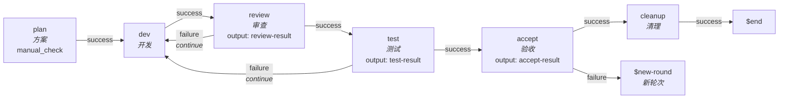

<div align="center">


# Gold Band

> 本地化 · 工作流驱动 · AI Agent 编排工具 
> 
> Harness Engineering | Loop Engineering
>
> 让长程 AI Coding 任务更可控、可观测、更可靠

[](https://github.com/diodeme/Gold-Band/stargazers)
[](LICENSE)
[](#)
[](https://github.com/diodeme/Gold-Band/releases)

[下载](https://github.com/diodeme/Gold-Band/releases)

[English](README.en.md)

</div>

---

Gold Band 目前处于**开发者预览阶段**。

项目名称来源于《西游记》中"金箍"的寓意：AI Agent 强大而富有创造力，但在复杂工程任务中同样需要边界、编排、验证和上下文管理。Gold Band 旨在提供这一工程化层，让 Agent 在长程任务中更稳定地发挥作用。

简单来说，Gold Band 可以理解为一个**本地 Agent 工作流版的 Dify**，但更侧重于开发工作流、本地执行、Agent 编排和 AI Coding 的可靠性。

## 状态

Gold Band 仍处于早期阶段。

当前 MVP 版本的核心链路已经能够跑通，但产品体验、边界情况、稳定性和工程细节仍在持续优化中。API、UX、工作流行为和内部实现在稳定版本发布前可能发生变化。

在这个阶段，早期用户的反馈尤为宝贵。与核心工作流相关的问题将被优先处理。

## 技术栈

- Rust
- React
- Tauri 2
- Agent Client Protocol / ACP

## 为什么做 Gold Band

在 AI Coding 的实践中，我反复遇到以下几个问题：

1. **长程任务难以可靠编排。**
   即使采用 subagent、agent team 等分治协作策略，一旦任务周期过长，主会话的 orchestrator 仍可能出现编排错误，甚至直接自己下场干活。

2. **Agent 自验证不一定可信。**
   在使用 loop 类工具时，同一个 Agent 既当运动员又当裁判，缺少交叉验证，`completed` 的结果不一定代表输出真的可靠。

3. **上下文和能力加载碎片化。**
   skill、constitution、MCP 工具、rules 等上下文来源在不同 Agent 之间往往各自管理，维护和迁移这些配置会越来越痛苦。

4. **Agent 平台的限制可能阻碍工作流设计。**
   例如，Claude Code 的 subagent 早期无法继承主会话的 skill 列表，只能由主 Agent 告知或提前定义，导致 subagent 能力受限。此问题在最新版本（v2.1.153）中已修复，但它曾是促使我想做一套外部编排和上下文管理层的触发因素之一。

Gold Band 的核心理念是：好的 AI 应用应该用工程化手段降低 AI 的不稳定性，同时保留 AI 的创造力。

## 核心能力

Gold Band 聚焦四个核心能力：

- **工作流编排**：定义 Agent 在规划、开发、审查、测试、验收、清理等阶段如何流转。
- **上下文管理**：管理角色，未来还将支持 skill、rules、MCP 等可复用上下文资产。
- **交叉验证**：将开发、审查、测试、验收分离，让结果由不同节点检查。
- **可观测性**：查看 Agent 会话、系统提示、原始 ACP 帧、产物、附件、轮次和 attempt。

## 功能

### 工作流编排

用户可在创建任务时为任务指定工作流。工作流可直接在画布中可视化创建，也可复用现有模板。Gold Band 也内置了一套工作流。


#### 概念

**节点**

每个节点代表一次 Agent 执行。用户可在 Agent 管理中配置 Agent。理论上任何 ACP 兼容的 Agent 都可以调起，但由于不同 Agent 对 ACP 的支持质量参差不齐，Gold Band 仅在完整测试通过后才将其加入推荐列表。当前阶段已验证通过的是 **Claude Code**。

**角色**

每个节点可指定一个角色，角色内容会追加到系统提示中。如果 ACP Agent 不支持追加 system prompt，Gold Band 目前会将其追加到 user prompt。角色可在上下文管理中进行管理。系统提供内置角色，用户可修改后另存为自定义角色。

**权限模式**

权限模式在 ACP 握手阶段获取。用户可在节点设置中选择支持的权限模式。

**结果判定**

结果判定决定节点完成后的分支走向。

Gold Band 目前支持两种方式：

1. **人工 check**：用户手动标记节点为成功或失败，适用于方案审核等需要人工确认的场景。
2. **AI 输出验证**：要求 Agent 输出结构化 DSL，Gold Band 通过表达式判定结果。

示例：

```json
{
  "reason": "String",
  "result": "boolean"
}
```

```js
$.result == true
```

**边**

边定义节点之间的连接方式。用户可编辑目标节点和会话模式：

- `new`：开启新会话
- `continue`：在上一个会话中继续


### 内置工作流

Gold Band 当前内置的默认工作流如下：



重点行为：

- 审查和测试不通过会回环到开发节点，使用 `continue` 模式进行修复。
- 验收节点验证需求是否真正完成。
- 验收失败则生成报告并开启新轮次。
- 验收通过后，清理节点整理过程产物并持久化到项目目录。
- 用户不必使用内置工作流，可自行创建偏好的工作流。

### 任务执行

用户可在任务目录下发起新的 run。一个需求可执行多次。run 启动后，用户可查看每一轮的详细执行情况。


#### 概念

**Attempt**

节点对之间的回环算一次 attempt。例如 `测试 -> failure -> 开发` 是一次 attempt。工作流可在运行时限制每对节点的最大 attempt 次数。

**Round**

节点可指定结束状态以开启新轮次。新轮次从头执行工作流，Gold Band 会在系统提示中告知 Agent 当前轮次和上轮产物目录。工作流可在运行时限制最大 round 次数。

**产物目录**

过程产物存放在：

```txt
~/.gold-band/projects/<project-path>
```

示例：

```txt
# artifacts
~/.gold-band/projects/D--Projects-code-ai-Gold-Band/tasks/task-001/runs/run-001/rounds/round-001/nodes/dev/attempt-001/artifacts

# attachments
~/.gold-band/projects/D--Projects-code-ai-Gold-Band/tasks/task-001/runs/run-001/rounds/round-001/nodes/dev/attempt-001/attachments
```

**Artifact**

对有明确输出要求的节点，Gold Band 自动将节点输出放到 `artifacts` 下。这与 AI 输出验证相关。

**Attachments**

Agent 可自由输出文件和报告到 `attachments` 下，如测试报告或中间笔记。

### 会话观测

节点运行中，用户可实时观察会话状态。会话结束后，用户也可打开对应的 CLI 会话。节点执行完后，用户可继续在该窗口对话，使用 `continue` 模式。


支持的观测内容：

- **系统提示**：Gold Band 运行时追加的 system prompt。
- **原始帧**：原始 ACP 会话帧，用于调试和问题排查。

### Agent 管理

Gold Band 通过 ACP 启动 Agent，并在 Agent 管理中提供配置和环境诊断。

虽然理论上支持所有 ACP 兼容的 Agent，但目前推荐优先使用 **Claude Code**，因为它已在当前实现中通过验证。


### 上下文管理

Gold Band 目前支持角色管理。内置角色不可直接修改或删除，但可复制后另存为自定义角色。

未来版本可能会扩展此区域，支持 skill、rules、MCP 等可复用上下文资产。


### 设置

当前设置项包括：

- 中 / 英文语言切换
- 主题切换
- 字体切换
- 更新机制
- 本地 Claude Code 开关

本地 Claude 开关为临时方案，后续可能会优化。开启时使用本地 Claude Code 可执行文件，关闭时 Claude Code ACP 组件会拉取 Claude Code SDK 中携带的 `claude.exe`。

## 权衡

内置工作流更适用于大型、复杂、长周期的开发任务。

通过将工作拆分为方案、开发、审查、测试、验收、清理等阶段，Gold Band 可以提供更强的约束和交叉验证。代价是执行时间和 token 消耗可能增加。这是基于工作流的 Agent 系统的常见权衡。

对于小型日常任务，用户可以定义更轻量的工作流，例如：

- `plan -> dev`
- `dev -> review`

未来 Gold Band 将探索 AI 动态路由，让系统根据任务复杂度选择合适的执行路径：简单任务快速通过，复杂任务自动分解、验证和循环。

## 路线图

### 高优先级

1. **多 Agent 支持**

   测试并集成 Codex、Cursor、Gemini CLI、OpenCode，根据兼容性和稳定性可能增加更多 Agent。

2. **系统通知**

   Agent 请求权限或工作流出错时进行系统通知，可在设置中配置。

3. **自适应工作流编排与并发执行**

   支持更灵活的执行策略，不局限于固定工作流路径。

   - **节点级并发**：一个节点可分发到多个下游节点并行处理子任务，可在实验室功能中配置最大并行数。
   - **需求级并发**：一次导入多个需求，复用同一套工作流并行执行，可在实验室功能中配置需求并行数。
   - **AI 动态路由**：工作流执行中，由 AI 根据当前目标、上下文、中间产物和执行结果，动态决定下一步进入哪些节点、拆分哪些子任务、是否需要并行执行。

### 中优先级

1. 增加对 skill 的支持与管理。
2. 增加对 MCP 的支持与管理。
3. 优化 ACP 会话观测的性能、UI、使用体验和已知问题。
4. 增加指标统计和数据看板，包括会话用时、token 消耗量等，校对当前会话计时的准确性。

## 社区

本项目积极参与和支持 [linux.do 社区](https://linux.do)。

## 贡献

Gold Band 处于开发者预览阶段，非常欢迎真实使用场景的反馈。

有价值的反馈包括：

- 核心工作流在哪里出问题或变得令人困惑。
- 编排模型在真实 AI Coding 场景中是否有用。
- 哪些 Agent 集成最重要。
- 哪些缺失的能力阻碍了实际使用。
- 任何 bug、粗糙边缘或不合理的设计选择。

欢迎提交 Issue 和 Pull Request。

## License

AGPL-3.0-only — 请参阅 [LICENSE](LICENSE) 文件。
