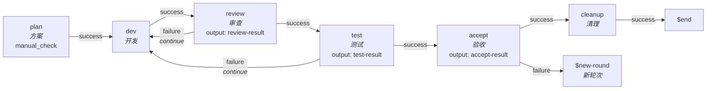
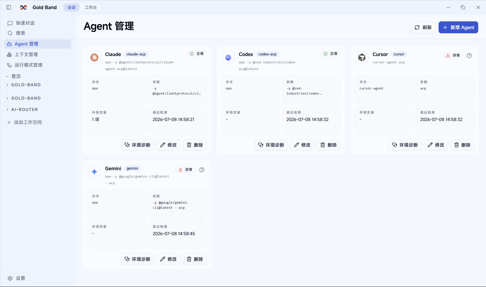
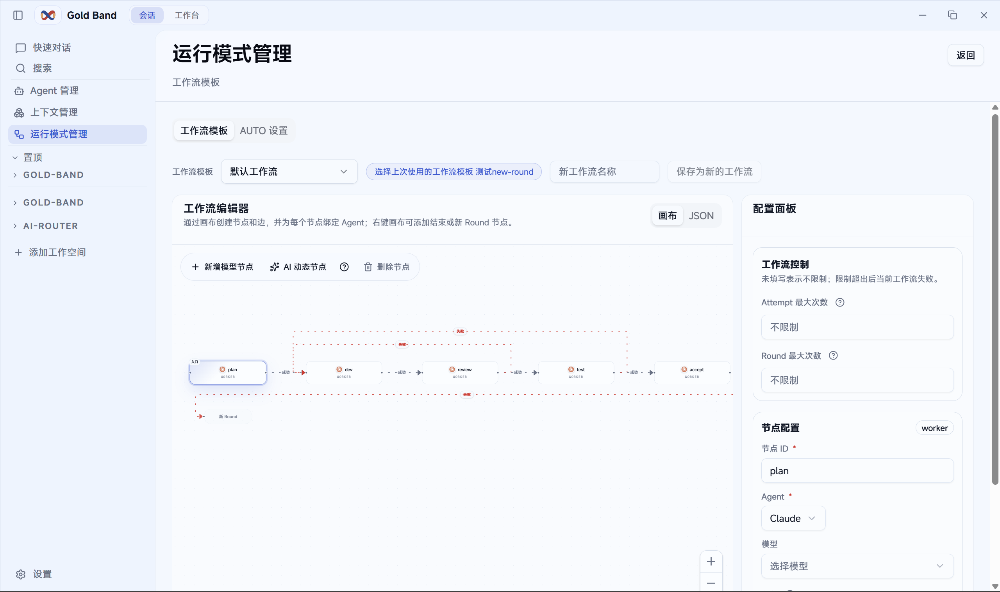
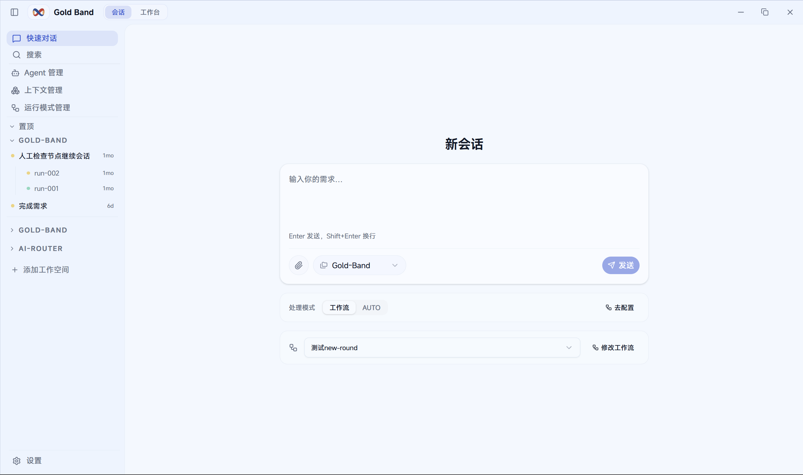
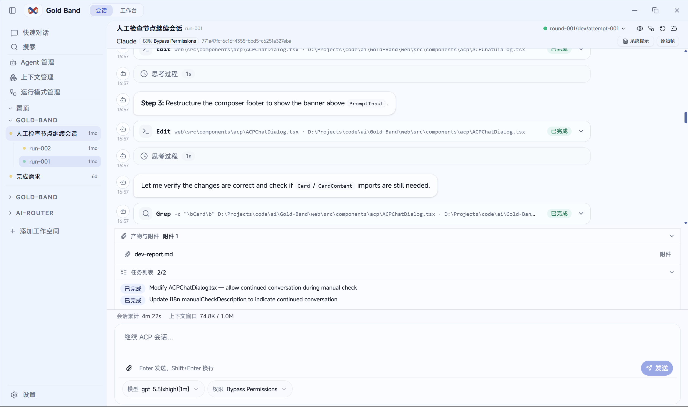
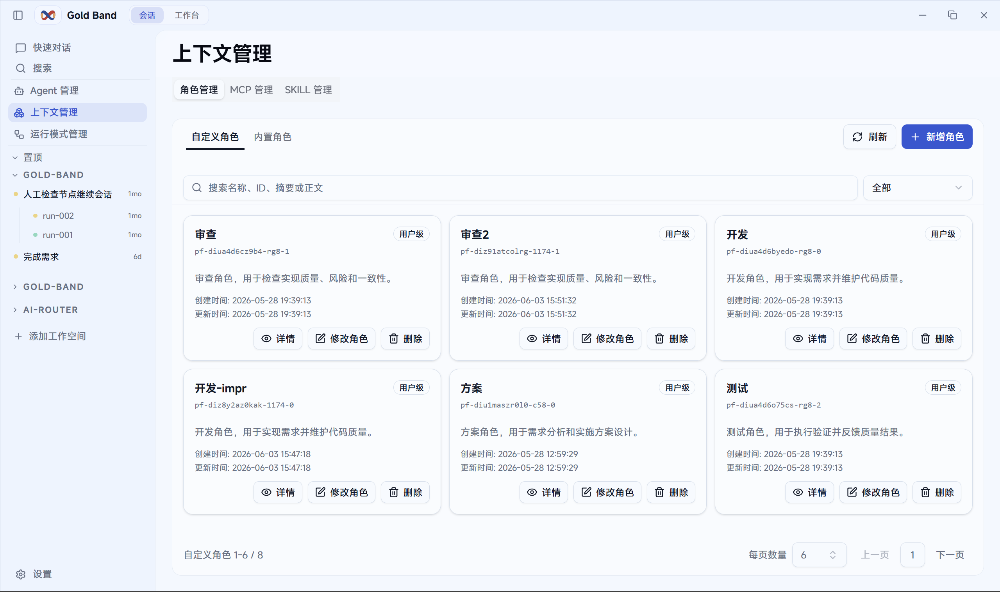

<div align="center">


# Gold Band

> 本地优先的 AI Coding 工作流桌面客户端
>
> 编排、观测、验证和恢复长程 Agent 任务

[](https://github.com/diodeme/Gold-Band/stargazers)
[](LICENSE)
[](#)
[](https://github.com/diodeme/Gold-Band/releases)

[下载](https://github.com/diodeme/Gold-Band/releases)

<!-- README-I18N:START -->

**中文** | [English](./README.en.md)

<!-- README-I18N:END -->

</div>

---

Gold Band 是一个面向本地项目的 AI Agent 工作流桌面客户端。它通过 Agent Client Protocol / ACP 调起本地 Agent，把长程 AI Coding 任务拆成可编排、可观测、可验证、可恢复的运行过程。

Gold Band 不试图替代 Claude Code、Codex、Cursor、Gemini 或 OpenCode。它更像这些 Agent 之上的本地 runtime 和桌面壳：负责工作流控制、上下文注入、产物归档、状态收敛、失败恢复和运行观测。

> [!NOTE]
> Gold Band 仍处于 **Developer Preview**。核心链路已经可用，但 AUTO / AI-DYNAMIC、多 Agent 兼容性、复杂任务稳定性和产品体验仍在快速迭代。推荐先使用 Claude Code 和 Codex 体验。

## 为什么做 Gold Band

AI Coding 真正难的往往不是让 Agent 写一次代码，而是让它在更长、更复杂的任务中稳定工作：

- **控制流容易漂移**：长程任务里，主会话可能忘记原始编排，甚至跳过验证直接自报完成。
- **自验证不可靠**：同一个 Agent 同时当执行者和裁判时，`completed` 不一定代表需求真的完成。
- **上下文管理碎片化**：profile、rules、skills、MCP、运行约束和修复指令分散在不同工具中，迁移和维护成本越来越高。
- **过程难以复盘**：如果没有统一的 run、round、node、attempt、artifact 和 raw event，失败后很难定位问题和恢复执行。

Gold Band 的核心思路是：**控制面确定化，执行面交给 Agent；完成判断基于状态、产物和验证，而不是只听 Agent 自述。**

## 核心能力

- **会话模式**：像 Agent IDE 一样发起需求、查看流式会话、切换 session、继续追问、查看输入附件和执行产物。
- **工作流模式**：用可视化画布编排 plan、dev、review、test、accept、cleanup 等节点，并支持失败回环与新 round。
- **AUTO / AI-DYNAMIC**：让运行时在约束内动态拆分任务、创建内部节点、fan-out 并行、merge、acceptance，再回到外层工作流。
- **多 Agent 管理**：通过 ACP 管理 Claude Code、Codex、Cursor、Gemini、OpenCode 等 provider 的配置和诊断状态。
- **运行观测**：查看 canonical state、ACP 会话事件、原始帧、系统提示、节点状态、token / 耗时信息、artifacts 和 attachments。
- **附件与产物**：支持文件选择、拖拽、粘贴图片、输入附件复用、图片预览、节点产物和自由附件查看。
- **上下文管理**：管理用户级 / 项目级 profile、MCP、SKILL管理，并在工作流和动态节点中复用。

## 快速开始

1. 从 [Releases](https://github.com/diodeme/Gold-Band/releases) 下载桌面包，或从源码构建。
2. 打开 Gold Band，添加一个本地 workspace。
3. 在 Agent 管理中配置一个可用 Agent。当前推荐先配置 Claude Code 和 Codex。
4. 回到会话首页，输入需求。
5. 选择运行模式：
   - `WORKFLOW`：使用固定工作流模板，适合流程明确、需要强验证的任务。
   - `AUTO`：让 AI-DYNAMIC 在约束内动态拆分和调度，适合更开放或更复杂的任务。
6. 发起运行后，在会话详情中观察 Agent 输出、节点切换、产物、附件和运行状态。

### 本地开发

```bash
npm install
npm run dev
```

常用验证命令：

```bash
cargo check
npm run web:test
npm run web:build
```

## 运行模式

### WORKFLOW

WORKFLOW 模式使用显式工作流。每个节点代表一次 Agent 执行，边决定成功、失败或人工确认后的流转方向。

典型默认工作流：


```mermaid
flowchart LR
      PLAN["plan<br/><i>方案</i><br/>manual_check"] -->|success| DEV["dev<br/><i>开发</i>"]
      DEV -->|success| REVIEW["review<br/><i>审查</i><br/>output: review-result"]
      REVIEW -->|success| TEST["test<br/><i>测试</i><br/>output: test-result"]
      REVIEW -->|"failure<br/><i>continue</i>"| DEV
      TEST -->|success| ACCEPT["accept<br/><i>验收</i><br/>output: accept-result"]
      TEST -->|"failure<br/><i>continue</i>"| DEV
      ACCEPT -->|success| CLEANUP["cleanup<br/><i>清理</i>"]
      ACCEPT -->|failure| NEW_ROUND["$new-round<br/><i>新轮次</i>"]
      CLEANUP -->|success| END["$end"]
```

这个模式适合：

- 有明确开发、审查、测试、验收阶段的需求。
- 希望失败后回到指定节点继续修复。
- 希望用结构化产物和验证规则固化验收标准。

### AUTO / AI-DYNAMIC

AUTO 模式会在运行时生成 `AI-DYNAMIC -> end` 形式的工作流。AI-DYNAMIC 是一个特殊复合节点：外层仍由 Gold Band runtime 控制，内部由 Agent 在 schema 和预算约束内提出下一步执行计划。

AI-DYNAMIC 可以：

- 创建单个后继节点。
- 创建 fan-out 分支并行处理子任务。
- 为可写并行分支创建独立 git worktree。
- 在分支结束后创建 merge 节点。
- 创建 acceptance 节点验收结果。
- 在验收不通过时继续生成修复节点。
- 调用已允许的 workflow snapshot。

AI-DYNAMIC 不能直接修改 runtime 状态。它只能输出结构化 proposal，由 Gold Band 校验后 materialize 成真实节点。

## 核心概念

| 概念 | 含义 |
|---|---|
| `workspace` | 一个本地项目目录，也是任务执行的工作区。 |
| `task` | 一次需求或目标。 |
| `run` | 对同一个 task 发起的一次执行。 |
| `round` | run 内的一轮工作流执行；验收失败时可以开启新 round。 |
| `node` | 工作流中的一次 Agent 执行或复合执行单元。 |
| `attempt` | 某个节点的一次尝试；失败回环或 retry 会产生新的 attempt。 |
| `artifact` | 有明确输出契约的规范化节点产物。 |
| `attachment` | Agent 或用户产生的自由文件，例如报告、截图、日志和中间材料。 |
| `provider` | Gold Band 通过 ACP 调起的 Agent 实现。 |

过程数据默认保存在用户目录下的 `.gold-band` 项目空间中，例如：

```txt
~/.gold-band/projects/<project-id>/tasks/<task-id>/runs/<run-id>/rounds/<round-id>/nodes/<node-id>/attempt-001/artifacts
~/.gold-band/projects/<project-id>/tasks/<task-id>/runs/<run-id>/rounds/<round-id>/nodes/<node-id>/attempt-001/attachments
```

## 界面

### Agent 管理

配置 ACP provider、模型、权限模式和环境诊断。当前已纳入 Claude Code、Codex、Cursor、Gemini、OpenCode 等 Agent 类型，实际可用性取决于本机环境和 provider 的 ACP 支持情况。



### 工作流编排

在画布中创建、查看和编辑 workflow 模板，配置节点 provider、profile、权限模式、输出契约和边的 session 策略。



### 快速对话

发起 ACP 会话，选择工作空间和运行模式



### 会话观测

查看 ACP 会话、系统提示、原始帧、产物和附件。运行中可以在不同 session / attempt 之间切换。



### 上下文管理

管理用户级和项目级 profile，并在工作流或动态节点中选择复用。



## 当前状态

已经可用的主路径：

- 桌面端会话模式和工作台模式。
- 固定 WORKFLOW 运行。
- AUTO / AI-DYNAMIC 模式。
- Claude Code ACP 和 Codex 主路径。
- 多 workspace 会话侧边栏。
- 输入附件、图片预览、产物和附件查看。
- run / round / node / attempt 状态观测。
- 工作流模板和 AUTO 模板管理。
- 角色、MCP、SKILL统一管理。

仍在打磨的方向：

- Cursor、Gemini、OpenCode 等多 Agent 的兼容性。
- 更稳定的runtime生命周期。
- 更优雅、轻量的内置提示词。
- 更流畅、更友好的UI体验。
- 更美观的主题。

正在开发的功能：

- 和IM工具打通。
- 新增定时任务能力。
- 新增本地数据看板能力。

通过将工作拆分为访谈、方案、开发、审查、测试、验收、清理等阶段，Gold Band 可以提供更强的约束和交叉验证。代价是执行时间和 token 消耗可能增加。这是基于工作流的 Agent 系统的常见权衡。


## 适合与不适合

适合：

- 长程 AI Coding 任务。
- 希望开发、审查、测试、验收分离的任务。
- 希望保留过程产物并能失败恢复的任务。
- 希望把多个本地 Agent 统一到同一套 workflow runtime 的用户。

暂不适合：

- 只需要一次性简单问答的场景。
- 要求稳定商用 SLA 的生产环境。
- 不愿意接受 Developer Preview 阶段 UI 和行为快速变化的用户。

## 技术栈

- Rust
- React
- Tauri 2
- Tailwind CSS
- shadcn/ui
- Agent Client Protocol / ACP

## 社区

本项目积极参与和支持 [linux.do 社区](https://linux.do)。

## 反馈

Gold Band 目前最需要真实使用反馈，尤其欢迎这些问题：

- AUTO 模式拆任务是否合理。
- WORKFLOW 模式的失败回环和验收是否真正有用。
- 多 Agent 接入哪里不顺。
- 会话、产物、附件和运行状态是否看得明白。
- 哪些错误应该被更早发现、更清楚提示或更容易恢复。

欢迎提交 Issue 和 Pull Request。

AGPL-3.0-only，详见 [LICENSE](LICENSE)。
