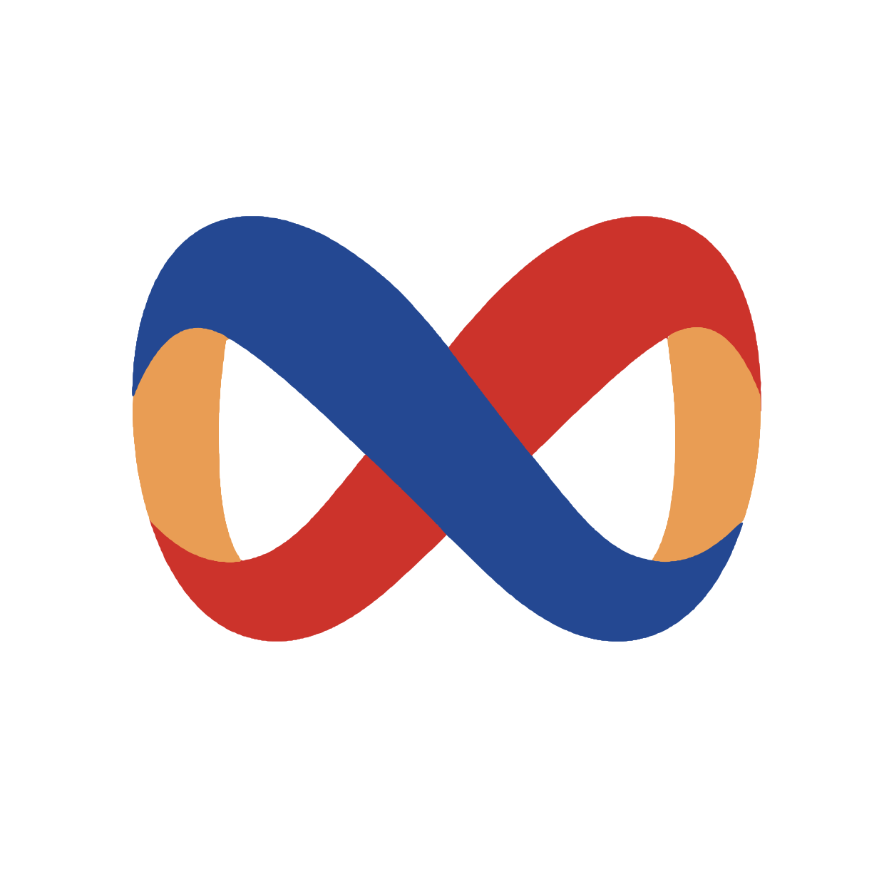

<div align="center">



# Gold Band

> 想成为你最后一款 Agent 桌面客户端
>
> 主流 Agent 客户端的体验 + 完整的工作流设计，兼顾日常开发与大型需求的长时间无人值守开发

[](https://github.com/diodeme/Gold-Band/stargazers)
[](../../LICENSE)
[](#平台与语言)
[](https://github.com/diodeme/Gold-Band/releases)

[下载](https://github.com/diodeme/Gold-Band/releases) · [在线 UI 预览](https://gold-band.dion.blue/zh/demo#)

<!-- README-I18N:START -->

[English](../../README.md) | **简体中文** | [繁體中文](./README.zh-TW.md) | [日本語](./README.ja-JP.md) | [한국어](./README.ko-KR.md) | [Português (Brasil)](./README.pt-BR.md) | [Español](./README.es.md)

<!-- README-I18N:END -->

</div>

---

Gold Band 是一个面向本地项目的 AI Agent 桌面客户端。它通过 Agent Client Protocol（ACP）连接 Claude Code、Codex 等主流 Agent：一个交互设计，多套 harness 随时切换；同时提供完整的工作流与 AUTO 编排，让长程任务更稳定、更可观测，不依赖模型抽奖式分发。

> [!TIP]
> 想先看看长什么样？打开 [在线 UI 预览](https://gold-band.dion.blue/zh/demo#)，推荐使用桌面端浏览器。在线预览能力受限，最终效果以客户端为准。

## 亮点

- **一个客户端接入主流 Agent**：内置 Claude Code、Codex、Cursor、Gemini CLI、CodeBuddy、Goose、Qwen Code、OpenCode、Kimi Code、Amp、Pi，也可以自定义接入任何支持 ACP 的 Agent。
- **三种运行模式**：DIRECT 直接会话、WORKFLOW 固定工作流、AUTO 动态编排，覆盖从日常问答到大型需求的各类任务。
- **工程化管理的工作流**：每个节点可单独配置 Agent、模型、角色和结果判定方式；支持回到过去的会话进行修复，也支持发起新的 round 继续实现需求。
- **面向大型任务的 AUTO 模式**：由节点拆分子任务并分发，每个子任务在独立 Git worktree 上执行，完成后由 merge 节点合并、accept 节点验收，再根据结果进入下一轮分发。
- **主流 Agent 客户端能力基本齐全**：SKILL、MCP、角色（Profile）管理，定时任务，文件查看与编辑，源码管理，内置浏览器，IM 远程干预与通知，壁纸、头像、字体、主题等个性化设置。
- **轻量**：基于 Tauri 2 + Rust，安装包仅几十 MB，多会话并行时内存占用约 300 MB。

## 支持的 Agent

| 内置 Agent | |
| --- | --- |
| Claude Code、Codex | 当前推荐的体验入口 |
| Cursor、Gemini CLI、CodeBuddy、Goose、Qwen Code、OpenCode、Kimi Code、Amp、Pi | 内置接入，可用性取决于本机环境及其 ACP 支持情况 |
| 自定义 Agent | 任何支持 ACP 协议的 Agent 都可以在 Agent 管理中手动接入 |

## 运行模式

### DIRECT

接近直接使用 Agent 本身。Gold Band 不注入工作流 system prompt，只负责统一的桌面 UI、会话保存、附件、模型与权限配置、停止恢复、Token 和耗时统计。

适合日常问答、代码修改、调试，以及希望保留持续上下文的开发会话。

### WORKFLOW

使用显式工作流。每个节点代表一次 Agent 执行，可以为节点单独选择 Agent、模型、角色和结果判定方式；边定义成功、失败或人工确认后的流转方向。运行后可以回到历史会话修复问题，或发起新的 round 继续推进。

适合需要明确开发阶段、独立审查与测试、失败回环和结构化验收的任务。

### AUTO / AI-DYNAMIC

由 AI-DYNAMIC 根据目标动态提出后续节点：拆分子任务、在各自的 worktree 中并行执行、由 merge 节点合并结果、由 accept 节点验收，再根据当前结果进行新一轮分发。Gold Band runtime 会校验 proposal 并管理真实运行状态，Agent 不能直接修改 runtime。

适合难以预先确定完整流程、但仍需要运行边界和可观测性的大型或复杂任务。

## 更多能力

- **会话体验**：流式输出、继续追问、历史恢复、会话复用、可选外部会话同步；在 composer 中选择模型、思考等级、权限模式和 Slash Command。
- **附件与产物**：文件选择、拖拽、图片粘贴、工作空间文件引用、附件预览和节点产物归档。
- **运行观测**：查看 Agent 消息、工具调用、系统提示、原始帧、Token、耗时和运行状态。
- **工作空间**：文件浏览与实时编辑、Git 源码管理、内置浏览器。
- **自动化与协作**：定时任务、IM 远程干预与通知（目前支持企业微信）、系统通知。
- **Agent 与上下文管理**：统一维护 Agent、Profile、MCP、SKILL 及用户级、项目级上下文，并提供 Agent 环境诊断。
- **个性化**：主题、壁纸、字体、用户与 Agent 自定义头像，以及个人数据分析。

## 快速开始

1. 从 [Releases](https://github.com/diodeme/Gold-Band/releases) 下载桌面安装包，或从源码构建。
2. 打开 Gold Band，添加一个本地工作空间。
3. 在 Agent 管理中启用 Claude Code、Codex（暂时需要本机已能正常启动 Claude Code / Codex）或其他 ACP Agent，并确认环境诊断通过。
4. 回到会话首页，选择运行模式：
   - `DIRECT`：直接与指定 Agent 持续对话，推荐首次使用。
   - `WORKFLOW`：使用固定工作流，适合流程明确、需要强验证的任务。
   - `AUTO`：让 AI-DYNAMIC 动态拆分和调度，适合开放或复杂目标。
5. 输入需求，并在会话详情中查看输出、交互请求、附件、产物和运行状态。

> [!IMPORTANT]
> 项目目前尚未取得 Apple Developer Program 开发者帐号，因此 macOS Release 尚未使用 Developer ID 签名和 Apple 公证。安装方式与 Gatekeeper 排错请参考 [macOS 安装与排错指南](../guide/macos-install.zh-CN.md)。

## 平台与语言

- **平台**：提供 Windows、macOS、Linux 安装包。当前优先保证 Windows 10 / 11 的使用体验，其次是 Apple Silicon 与 Intel Mac；Linux 版本尚未完成完整测试。
- **界面语言**：简体中文、繁體中文、English、日本語、한국어、Português (Brasil)、Español。

## 常见问题

### 和 Coding Agent 内部的工作流有什么区别？

Coding Agent 内部的工作流主要是「主 Agent 编排子 Agent」或「脚本编排 Agent」，编排的是 **session**；Gold Band 编排的是 **harness**。只要支持 ACP，任何 Agent 都可以成为一个节点：例如用内置 browser 与 computer use 能力的 Codex 作为验收节点，用极简、快速的 Pi 作为开发节点。节点之间的差异可以是一整套 harness 的差异，而不只是上下文的差异。

### 和 Codex App 这类 Agent 客户端有什么区别？

这类客户端围绕某一个固定 Agent 构建；Gold Band 位于 Agent 的上层，可以切换并组合不同架构的 Agent，同时继承它们各自的能力。代价是 Gold Band 无法侵入 Agent 内部循环，例如在 Agent loop 中途插入用户引导这类能力实现成本更高。

### 和其他 ACP 客户端有什么区别？

Gold Band 从工作流出发，ACP 客户端能力是在此基础上补齐的。工作流不只是简单调度，还包括验收标准、前文摘要、停止与继续、AUTO 模式下的节点归并等工程能力，由 runtime 统一管理节点推进与失败处理，Agent 专注于当前节点的任务。

## 当前状态与规划

已知问题：

- 工作流和 AUTO 模式基于对抗式验证和 loop 思想，耗时与 Token 消耗会高于直接让 Agent 干活，但能减少返工。
- 内置终端和移动端远程控制尚未提供。

后续规划：

1. 持续优化客户端交互体验，修复已知 UI Bug。
2. 完善工作流的工程化与易用性，例如任意节点重跑、自然语言创建工作流。
3. 使用工作流和 AUTO 模式完成一个典型的极复杂需求，公开展示编排的有效性。
4. 按 client → p2p / relay → host 架构重构，支持本地与远程目录作为工作空间，以及多端 client 操控同一个 host。

## 适合与不适合

适合：

- 希望用一个桌面客户端使用多个本地 Coding Agent。
- 需要持续对话、历史恢复和附件协作的开发任务。
- 需要把开发、审查、测试和验收分开的长程任务。
- 希望保留运行过程、产物并支持失败恢复的任务。

暂不适合：

- 要求稳定商用 SLA 的生产环境。
- 依赖尚未完整支持的 ACP Agent 或 Provider 特性。

## 本地开发

```bash
npm install
npm run dev
```

常用验证命令：

```bash
cargo check
npm run web:test
npm run web:build
```

## 技术栈

- Rust
- React
- Tauri 2
- Tailwind CSS
- shadcn/ui
- prompt-kit
- Agent Client Protocol / ACP

## 社区与反馈

本项目积极参与和支持 [linux.do 社区](https://linux.do)。欢迎 Star、试用，并通过 Issue 和 Pull Request 反馈 Agent 接入、会话体验、工作流、AUTO 拆解质量及异常恢复问题。

AGPL-3.0-only，详见 [LICENSE](../../LICENSE)。
